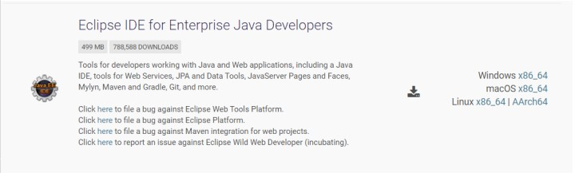
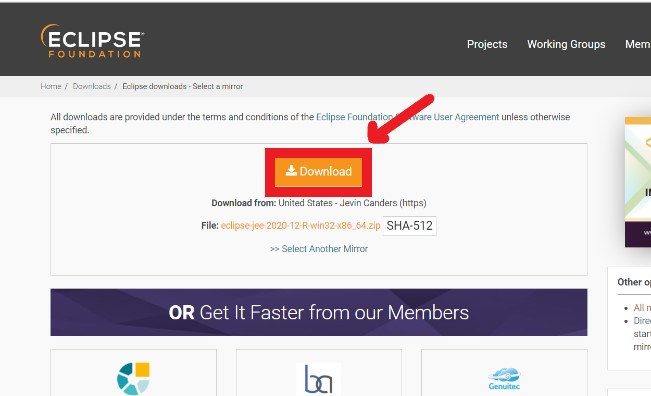
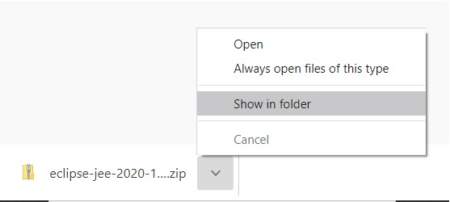
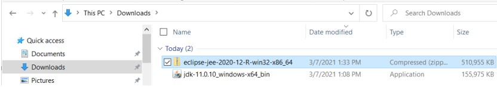
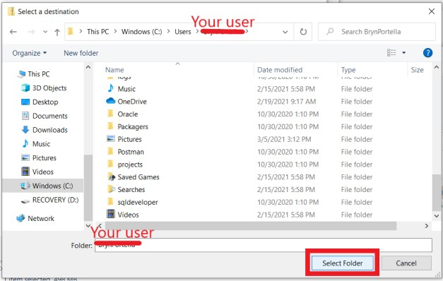

# Eclipse Install

Now that we have Java installed, we will need to download Eclipse. Eclipse is an IDE, or Integrated Development Environment. This is where you will write, deploy and test your code. A good IDE brings many features to the table to make your life easier, like error checking, warnings about dangerous code, and management of any 3rd-party libraries or tools you might be using. You can get the latest version of Eclipse from the download link provided here: 

[Eclipse](https://www.eclipse.org/downloads/packages/)

1. Scroll down to select the Eclipse IDE for Enterprise Java Developers.

2. Click on the download appropriate for your OS. This will bring up a download page. Click the download option.

3. This will prompt a download of a zip file. You should view this zip file in your file explorer. You can do this by opening the file explorer and navigating to the Downloads Folder. Alternatively you can right click on the newly downloaded file and select "Show in Folder". 

4. This will reveal the download in your Downloads folder. You should see something like the following:

5. Right click on the file to Select Extract All. Unzip the downloaded ZIP archive to a 
destination of your choosing.
> Note: Unlike Java, there's nothing to traditionally install with Eclipse - the entire application will be contained in the folder you've unzipped! So be mindful of the location you select and don't move any files out of the folder. 

You can choose a location other than your Downloads folder on Windows by selecting "Browse" in the popup after choosing Extract All. 

A good option is to select your user home. 
You can navigate there on Windows by selecting Windows(C:)> Users> Your username

> Note, it may take a long time to extract all of the files.

5. Once you computer finishes extracting the files, your "installation" has completed and you can launch Eclipse by double clicking on the application file in the folder of your installation.

6. For ease of access, Right-click the eclipse application, and select, "Create Shortcut." Place this shortcut on your desktop.